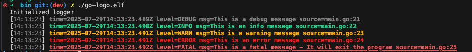

# go-logo
A golang logging library that allows logging to the console, to a channel or both.


## Features
- Multiple log levels (TRACE, DEBUG, INFO, WARN, ERROR, FATAL)
- Multiple output formats (text, JSON, pretty JSON)
- Multiple output destinations (console, file, channel)
- Colorized console output
- Structured logging with attributes
- Source code location information
- File rotation with size and age limits
- Context-aware logging
- Channel-based logging for asynchronous processing

## Usage
```bash
/workspace/bin ./go-logo.elf
Initialized logger
[14:11:09] time=2025-07-29T14:11:09.752Z level=DEBUG msg=This is a debug message source=main.go:21
[14:11:09] time=2025-07-29T14:11:09.752Z level=INFO msg=This is an info message source=main.go:22
[14:11:09] time=2025-07-29T14:11:09.752Z level=WARN msg=This is a warning message source=main.go:23
[14:11:09] time=2025-07-29T14:11:09.753Z level=ERROR msg=This is an error message source=main.go:24
[14:11:09] time=2025-07-29T14:11:09.753Z level=FATAL msg=This is a fatal message - It will exit the program source=main.go:25
exit status 1
```

### Colored output


## Example
Example source code is given in the [examples](examples/) directory.

### Logging to console
```golang
package main

import (
	"fmt"
	"log/slog"
	logger "logo/logo"
)

func main() {

    // Initialize the logger with desired options
	logger.Init(
		logger.AddSource(),                                    // Log source caller information
        logger.SetLevel(slog.LevelDebug),                      // Set minimum log level
        logger.AddFileOutput("logs/app.log", 10, 3, 30, true), // Log to file with rotation
	)

    // Get the logger instance
	log := logger.L()
	fmt.Println("Initialized logger")

    // Log messages at different levels
	log.Trace("This is a trace message - It will not show up")
	log.Debug("This is a debug message")
	log.Info("This is an info message")
	log.Warn("This is a warning message")
	log.Error("This is an error message")
	log.Fatal("This is a fatal message - It will exit the program")
}
```

## Configuration Options
### Log levels
```golang
logger.Init(
    logger.SetLevel(slog.LevelDebug), // Standard log levels: DEBUG, INFO, WARN, ERROR
    logger.EnableTrace(),             // Enable TRACE level (below DEBUG)
)
```

### Output Formats
```golang
// Text format (default)
logger.Init()

// JSON format
logger.Init(
    logger.UseJSON(false) // Compact JSON
)

// Pretty JSON format
logger.Init(
    logger.UseJSON(true) // Pretty-printed JSON
)
```

### Output Destinations
```golang
// Console output (default)
logger.Init()

// File output with rotation
logger.Init(
    logger.AddFileOutput("logs/app.log", 10, 3, 30, true)
    // Parameters: path, maxSize (MB), backups, maxAge (days), compress
)

// Channel output
logger.Init(
    logger.AddChannelOutput(logChan) // logChan is a chan string
)

// Multiple outputs
logger.Init(
    logger.AddFileOutput("logs/app.log", 10, 3, 30, true),
    logger.AddChannelOutput(logChan)
)

// Disable console output when using other outputs
logger.Init(
    logger.DisableConsole(),
    logger.AddFileOutput("logs/app.log", 10, 3, 30, true)
)
```

### Additional Features
```golang
// Add source file and line information
logger.Init(
    logger.AddSource()
)

// Disable colored output
logger.Init(
    logger.DisableColors()
)

// Use custom handler
logger.Init(
    logger.UseCustomHandler(myCustomHandler)
)

// Context-aware logging
ctx := context.WithValue(context.Background(), "request_id", "req-123")
requestLogger := logger.WithContext(ctx)
requestLogger.Info("Processing request") // Includes request_id automatically
```

## Building
The included Makefile makes building and managing the project easy:

```bash
# List available commands
make help

# Format code and tidy dependencies
make tidy

# Build for current platform
make build

# Build for Windows
make buildwin

# Build for both platforms
make all

# Clean build artifacts
make clean
```

## Examples
Check the examples directory for more detailed examples:

- Text logging
- JSON logging
- Pretty JSON logging
- File logging without console
- Channel-based logging
- Context-aware logging
- Comprehensive logger configuration

## Enhancements
- Migrate from [Lumberjack](https://github.com/natefinch/lumberjack) to [timberjack](https://github.com/DeRuina/timberjack/)

## Acknowledgments
- [natefinch](https://github.com/natefinch) for the [Lumberjack](https://github.com/natefinch/lumberjack) package to handle log files and rotations
- [charmbracelet](https://github.com/charmbracelet) for the [lipgloss](https://github.com/charmbracelet/lipgloss) package for ANSI coloring